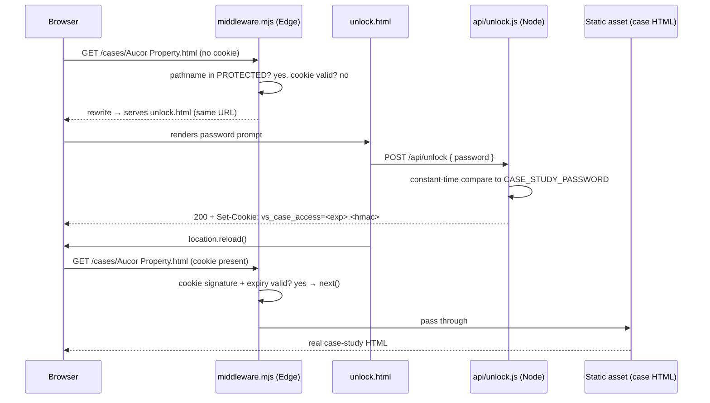
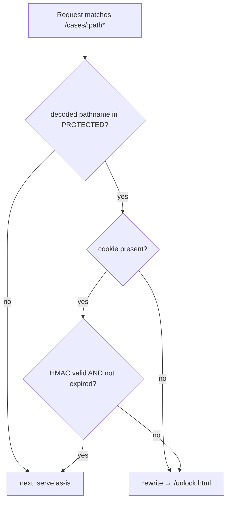

# feat: Password-protect case studies (server-side gate)

**Date:** 2026-06-25
**Type:** feat
**Depth:** Standard
**Origin:** Linear DES-38 — "Password protect case studies" (https://linear.app/trail-brew/issue/DES-38) / GitHub issue #5

---

## Summary

Put the two **client** case-study detail pages (Aucor Property, SCIS at Wits) behind a single shared password that the studio owner hands out manually. Access is gated **server-side** on Vercel — the protected HTML is genuinely withheld until the password is verified, not merely hidden in the browser. The **Vanta Studio** case study stays public (it's the marketing thesis), as do the homepage and all preview cards.

A visitor who opens a protected case study is served a password prompt at the same URL. Submitting the correct password sets a signed, HttpOnly cookie; the page then reloads and the real content is served. The cookie keeps them unlocked for the rest of a long-lived session (default 30 days), across both protected pages.

---

## Problem Frame

The Work section drives to case-study detail pages that currently expose real client outcomes and screenshots to anyone. The owner wants to share specific client work only with people they've chosen, by giving them a password beforehand. The requirement is genuine access control ("ensure only people who have access from me can view that info"), not a cosmetic speed bump — so a client-side-only check (which leaves the HTML fetchable via View Source / `curl`) does **not** satisfy it. The site is already deployed on Vercel and already runs one serverless function, so a server-side gate fits the existing infrastructure.

**In scope**
- Server-side password gate on `cases/Aucor Property.html` and `cases/SCIS at Wits.html`.
- A single shared password + a signed session cookie that unlocks both.
- A styled unlock/prompt page consistent with the site's design system.
- Honest UX signalling on the homepage (a small "locked" affordance on protected cards).
- Documentation + the env-var setup the owner needs to operate it.

**Out of scope** — see Scope Boundaries.

---

## Key Technical Decisions

### KTD-1 — Server-side gate via Vercel Routing (Edge) Middleware, not client-side JS
Vercel Routing Middleware runs **before** a request is served and can withhold the static HTML entirely. This is the only approach that meets the access-control requirement. A client-side gate was rejected: the case-study HTML would still be served as a static asset and readable via View Source or `curl`, defeating the purpose. *(External research: Vercel Routing Middleware API, last updated 2026-01-28.)*

### KTD-2 — Allowlist-in-code, gate-by-PROTECTED-list (not matcher-only)
The middleware `config.matcher` runs the middleware on all `/cases/:path*` requests, but the **block decision** is made in code against an explicit `PROTECTED` array of decoded pathnames (`/cases/Aucor Property.html`, `/cases/SCIS at Wits.html`). Everything else under `/cases/` — the public `Vanta Studio.html`, plus shared assets `shared.jsx` and `case-study.css` — falls through to `next()`. Rationale: keeping Vanta Studio and the shared assets public via a positive PROTECTED list is far less error-prone than encoding "all cases except one (whose filename contains a space)" as a matcher regex. Adding a future protected case = one array entry.

### KTD-3 — `middleware.mjs` (ESM) + CommonJS functions side-by-side
Vercel requires a non-framework middleware to be ESM — either `"type":"module"` in `package.json` **or** a `.mjs` file. The existing `api/callback.js` is CommonJS (`module.exports`). Setting `"type":"module"` globally would break it. **Decision:** name the middleware `middleware.mjs` and keep `package.json` **without** `"type":"module"`, so `api/*.js` functions stay CommonJS. This is a deliberate, documented deviation from CLAUDE.md §2 ("no package.json") — the package.json exists only to declare the `@vercel/functions` dependency for the middleware; it adds **no** front-end build step.

### KTD-4 — Signed-cookie session via HMAC-SHA256, split sign/verify across runtimes
- **Sign** (Node, `api/unlock.js`): on correct password, compute `HMAC-SHA256(payload, CASE_ACCESS_SECRET)` where `payload` is the cookie's expiry timestamp; set cookie `value = "<exp>.<base64url(hmac)>"`.
- **Verify** (Edge, `middleware.mjs`): recompute the HMAC with Web Crypto (`crypto.subtle`) over the same payload and constant-time-compare; reject if expired or mismatched.
HMAC-SHA256 is identical across Node `crypto` and Edge Web Crypto, so a cookie signed in the Node function verifies in the Edge middleware. A signed cookie (vs. a static "unlocked=1" flag) prevents forgery. Cookie attributes: `HttpOnly; Secure; SameSite=Lax; Path=/; Max-Age=<30d>`.

### KTD-5 — Rewrite-in-place for the prompt (no `?next=` plumbing)
On a blocked request the middleware returns `rewrite(new URL('/unlock.html', request.url))` — the prompt is served **at the original case-study URL**. After a successful unlock the page calls `location.reload()`; the cookie is now present, the middleware passes the request through, and the real content renders. This avoids redirect/return-URL bookkeeping. `unlock.html` references assets by **root-absolute** paths (`/styles.css`) so they resolve correctly regardless of which `/cases/...` URL it's rendered at.

### Cookie & token contract (shared by U2 and U3 — keep in sync)
- **Cookie name:** `vs_case_access`
- **Value:** `<expMs>.<base64url(HMAC-SHA256(<expMs>, CASE_ACCESS_SECRET))>`
- **Validity:** signature matches **and** `Date.now() < expMs`
- **Set by:** `api/unlock.js` (Node) on correct password
- **Read by:** `middleware.mjs` (Edge) on every protected request
- **Attributes:** `HttpOnly; Secure; SameSite=Lax; Path=/; Max-Age=2592000` (30 days)

### Environment variables (set in Vercel → Project → Settings → Env Vars)
- `CASE_STUDY_PASSWORD` — the shared password the owner distributes. Use a **strong passphrase** (see Risks — this is the primary brute-force mitigation).
- `CASE_ACCESS_SECRET` — a long random string used only to sign/verify the cookie. Never shared.

---

## High-Level Technical Design

### Request flow (unauthenticated → unlock → content)



### Middleware decision logic



*Directional guidance for the implementer, not implementation specification.*

---

## Implementation Units

### U1. Minimal `package.json` for the middleware dependency
**Goal:** Declare `@vercel/functions` so the Edge middleware can import `rewrite`/`next`, without introducing a front-end build step or breaking the existing static deploy.
**Requirements:** Enables U3.
**Dependencies:** none.
**Files:** `package.json` (new).
**Approach:**
- Create a minimal manifest: `name`, `private: true`, a `dependencies` entry for `@vercel/functions` (latest stable).
- **Do not** add `"type":"module"` (KTD-3) and **do not** add a `build` script — Vercel must keep treating the project as static-plus-functions (Framework Preset "Other"). Run an install so a lockfile is produced for reproducible Vercel builds.
- Keep `index.html`'s in-browser React/Babel CDN setup untouched — this package.json is server-only.
**Patterns to follow:** none in-repo (first package.json); mirror the minimalism of `api/callback.js`'s "only what's needed" style.
**Test scenarios (manual verification):**
- After `npm install`, `@vercel/functions` resolves locally and `node -e "import('@vercel/functions')"`-style import succeeds (sanity that the dep is present).
- A Vercel **preview** deploy still serves the homepage `/` and the existing `/api/callback` endpoint unchanged (regression: adding package.json did not flip the project into an unexpected build mode). If the preview tries to run a build, pin static behavior via a `vercel.json` (`"buildCommand": ""`, `"framework": null`) — noted as the fallback in Deployment Notes.
**Verification:** Preview deploy is green; homepage and callback form behave exactly as before.

### U2. `api/unlock.js` — verify password, set signed cookie
**Goal:** A Node serverless function that accepts a password, constant-time-compares it to `CASE_STUDY_PASSWORD`, and on success returns a `Set-Cookie` with the HMAC-signed session token.
**Requirements:** Core of the gate; produces the cookie that U3 verifies.
**Dependencies:** none (but shares the Cookie & token contract with U3).
**Files:** `api/unlock.js` (new).
**Approach:**
- CommonJS (`module.exports = async function handler(req, res)`), mirroring `api/callback.js` exactly: POST-only (405 otherwise), tolerant JSON body parse, 500 when env vars are missing.
- Read `CASE_STUDY_PASSWORD` and `CASE_ACCESS_SECRET` from `process.env`; if either is missing, 500 with a friendly message.
- **Constant-time compare:** hash both the submitted password and the expected password (e.g. SHA-256) to equal-length buffers, then `crypto.timingSafeEqual` — avoids leaking length and short-circuit timing.
- On match: `exp = Date.now() + 30d`; `sig = base64url(HMAC-SHA256(String(exp), CASE_ACCESS_SECRET))`; set `vs_case_access=<exp>.<sig>` with the contract's attributes via `res.setHeader('Set-Cookie', ...)`; return `{ ok: true }`.
- On mismatch: return `401 { error: 'Incorrect password.' }`. Add a small fixed delay on failure (light brute-force friction; see Risks).
- Optional honeypot field (`company_url`) mirroring `callback.js`, returning a benign `200` — cheap bot deterrence.
**Patterns to follow:** `api/callback.js` (structure, env-guard, error JSON shape, `clean()` helper).
**Test scenarios (manual verification):**
- `curl -X POST /api/unlock` with the **correct** password → `200`, response carries `Set-Cookie: vs_case_access=...; HttpOnly; Secure; SameSite=Lax; Path=/`.
- Wrong password → `401 { error: 'Incorrect password.' }`, **no** Set-Cookie.
- Missing/empty password → `400`.
- `GET /api/unlock` → `405`.
- With `CASE_STUDY_PASSWORD`/`CASE_ACCESS_SECRET` unset → `500` with friendly message (env-guard).
- Cookie token round-trips: the `<exp>.<sig>` produced here verifies under U3's Edge logic with the same secret (integration — proven in U3's tests).
**Verification:** Correct password yields a valid signed cookie; wrong password never sets one.

### U3. `middleware.mjs` — gate protected case studies
**Goal:** Intercept `/cases/:path*`, let public paths and authenticated requests through, and rewrite unauthenticated requests for protected pages to the unlock prompt.
**Requirements:** Enforces the access boundary (the crux of DES-38).
**Dependencies:** U1 (`@vercel/functions`), U2 (cookie contract), U4 (rewrite target must exist).
**Files:** `middleware.mjs` (new, repo root).
**Approach:**
- `export const config = { matcher: ['/cases/:path*'] }`; default-export `middleware(request)`.
- `PROTECTED = ['/cases/Aucor Property.html', '/cases/SCIS at Wits.html']` (decoded). Decode `new URL(request.url).pathname` with `decodeURIComponent` before comparing.
- If pathname **not** in `PROTECTED` → `return next();` (covers Vanta Studio, `shared.jsx`, `case-study.css`, images).
- Else read the `vs_case_access` cookie from `request.headers.get('cookie')`. Validate per the contract: split on `.`, check `Date.now() < exp`, recompute `HMAC-SHA256(String(exp), CASE_ACCESS_SECRET)` via `crypto.subtle` (import key + sign), base64url-encode, and **constant-time** compare to the cookie's signature.
- Valid → `return next();`. Missing/invalid/expired → `return rewrite(new URL('/unlock.html', request.url));`.
- `CASE_ACCESS_SECRET` is read from `process.env` (available to Edge middleware as a Vercel env var).
**Patterns to follow:** Vercel Routing Middleware API "other frameworks" examples (`import { rewrite, next } from '@vercel/functions'`; `export const config = { matcher }`).
**Technical design (directional):**
```js
// middleware.mjs — directional, not final
import { rewrite, next } from '@vercel/functions';
export const config = { matcher: ['/cases/:path*'] };
const PROTECTED = ['/cases/Aucor Property.html', '/cases/SCIS at Wits.html'];
export default async function middleware(request) {
  const path = decodeURIComponent(new URL(request.url).pathname);
  if (!PROTECTED.includes(path)) return next();
  const cookie = readCookie(request, 'vs_case_access');
  if (cookie && await isValid(cookie)) return next();   // HMAC + expiry check
  return rewrite(new URL('/unlock.html', request.url));
}
```
**Test scenarios (manual verification — these are the security-critical ones):**
- `curl /cases/Aucor%20Property.html` **without** cookie → response is the **unlock prompt**, NOT the case content (assert the case headline string is absent). *Covers the core access-control requirement.*
- Same for `/cases/SCIS%20at%20Wits.html`.
- `curl` with a **valid** cookie (from U2) → real case content served (assert headline present).
- `curl` with a **tampered** cookie (mutated signature) → unlock prompt, not content.
- `curl` with an **expired** cookie (`exp` in the past) → unlock prompt, not content.
- `curl /cases/Vanta%20Studio.html` **without** cookie → real content (public path falls through).
- `curl /cases/shared.jsx` and `/cases/case-study.css` without cookie → served normally (public assets, so the public Vanta Studio page renders for anonymous visitors).
- Homepage `/` and `/api/callback` unaffected (matcher scoped to `/cases/`).
**Verification:** Protected pages are unreadable without a valid cookie; public page and shared assets render anonymously; authenticated session sees real content.

### U4. `unlock.html` — the password prompt page
**Goal:** A styled, self-contained prompt served in place of a protected case study; on correct password it unlocks and reveals the page.
**Requirements:** The visitor-facing half of the gate.
**Dependencies:** consumed by U3's rewrite; posts to U2.
**Files:** `unlock.html` (new, repo root).
**Approach:**
- Plain HTML (no React needed). Load fonts + `/styles.css` (**root-absolute**, per KTD-5) so it inherits the dark theme + lime accent. Center a small card: studio wordmark, a short line ("This case study is private — enter the password the studio shared with you."), a password input, a submit button, and an inline error region.
- Inline `<script>`: on submit, `POST /api/unlock` with `{ password }`. On `200` → `location.reload()` (cookie now set; middleware serves the real page). On `401`/error → show inline error, keep the visitor on the prompt. Disable the button while in-flight.
- Match the site's voice and the existing `CallbackForm` inline success/error pattern (`sections.jsx`).
- Use root-absolute paths for any asset so the page renders correctly at any `/cases/...` URL it's rewritten to.
**Patterns to follow:** `CallbackForm` in `sections.jsx` (inline fetch + success/error states); the design tokens/classes in `styles.css`.
**Test scenarios (manual verification):**
- Visiting a protected case study renders the prompt with correct dark-theme styling at ~375px and ~1280px.
- Correct password → page reloads into the real case study.
- Wrong password → inline error shown, no navigation, input stays focused.
- Theme/accent match the rest of the site (no unstyled flash; `/styles.css` resolved).
**Verification:** The prompt looks intentional in both viewports and successfully unlocks on the correct password.

### U5. Homepage "locked" affordance on protected cards
**Goal:** Signal on the Work cards that Aucor and SCIS are password-protected, so a visitor understands why they hit a prompt (honest UX; supports conversion clarity). Links are unchanged.
**Requirements:** UX clarity; optional but low-cost.
**Dependencies:** none (cosmetic).
**Files:** `work.jsx` (modify), `styles.css` (modify).
**Approach:**
- Add `locked: true` to the Aucor and SCIS entries in `CASE_STUDIES`. Leave Vanta Studio and all LAB entries unflagged.
- In `CaseHeroCard`, when `c.locked`, render a small lock badge (e.g. a `🔒 Private` chip near the existing `c.kind · c.year` mono label). Keep `href` exactly as-is — navigation still goes to the case URL; the gate does the rest.
- Add a `.case-card-lock` style consistent with tokens; verify it reads correctly in **both** themes (lime is fill-only on light — KTD/CLAUDE §4: use a class the `[data-theme="light"]` block can override, not inline lime text).
- Bump the `styles.css?v=N` cache-buster in `index.html` (CLAUDE §7).
**Patterns to follow:** `case-card-kind` rendering in `CaseHeroCard` (`work.jsx`); the design-token + light-mode override conventions in `styles.css`.
**Test scenarios (manual verification):**
- Aucor and SCIS cards show the lock badge; Vanta Studio and LAB cards do not.
- Badge is legible in dark **and** light themes.
- Card links still navigate to the correct case URLs.
**Verification:** Protected cards are visually marked; nothing else about the Work section changes.

### U6. Documentation + operator setup
**Goal:** Document the gate so future agents and the owner can operate and extend it.
**Requirements:** Repo convention (CLAUDE.md is the canonical agent context).
**Dependencies:** reflects U1–U5.
**Files:** `CLAUDE.md` (modify).
**Approach:**
- New short section (e.g. "§9 Case-study access gate") covering: which pages are protected and how to add another (one `PROTECTED` entry + `locked: true`); the two env vars and that the DB of "who has the password" is just the owner; the `middleware.mjs`-is-ESM-while-`api/*.js`-stays-CommonJS gotcha (KTD-3); the cookie contract; and the **local-dev caveat** — the gate only runs under `vercel dev` or a deployed preview, never `python -m http.server` (same exception class as `api/callback.js`).
- Note `@vercel/functions` + `package.json` as the documented deviation from §2's "no package.json".
- Record that `assets/work/` screenshots remain public by design (already shown on homepage cards) — see Scope Boundaries.
**Patterns to follow:** Existing CLAUDE.md §8 (contact/conversion) tone and structure.
**Test scenarios:** Test expectation: none — documentation only.
**Verification:** A fresh reader can set the env vars, run `vercel dev`, and add a new protected case from CLAUDE.md alone.

---

## Scope Boundaries

**Deferred to Follow-Up Work**
- **Per-visitor codes / revocation.** The owner chose a single shared password. Individually issued, revocable codes would need persistent state (Vercel KV / Upstash) — a separate effort.
- **Robust rate limiting / lockout.** Stateless functions can't durably count attempts; this needs KV-backed counters. U2 includes only a small fixed failure delay as light friction.
- **Gating `assets/work/` screenshots.** The desktop/mobile screenshots are already shown publicly on the homepage Work cards, so the detail-page *prose, metrics, and approach* are what's protected — not the images. Gating the image files too would be a deliberate additional scope (and would require de-risking the homepage previews).

**Out of scope (non-goals)**
- Email/account-based auth, OAuth, or any identity system.
- Protecting the homepage, LAB cards, or the public Vanta Studio case study.
- Analytics on who unlocked.

---

## Risks & Mitigations

- **Brute-force against the shared password.** Primary mitigation: a **strong passphrase** in `CASE_STUDY_PASSWORD` (high entropy makes online guessing infeasible). Secondary: a small fixed delay on failed attempts (U2). Durable rate-limiting is deferred (needs KV).
- **Password sharing / leakage.** Inherent to a shared secret. If it leaks, the owner rotates `CASE_STUDY_PASSWORD` (and optionally `CASE_ACCESS_SECRET` to invalidate all existing cookies). Documented in U6.
- **Adding package.json flips the Vercel build mode.** Low risk, but verified explicitly in U1's preview-deploy check; fallback is a pinning `vercel.json`.
- **ESM/CommonJS mismatch breaking the existing function.** Avoided by KTD-3 (`.mjs` middleware, no global `"type":"module"`). Called out so a future change doesn't naively add `"type":"module"`.
- **Cookie not sent over local `vercel dev`.** `Secure` cookies are honored on `localhost` (treated as a secure context) by modern browsers, so local testing works; documented in U6.

---

## Deployment Notes

- **Set env vars first:** `CASE_STUDY_PASSWORD` (strong passphrase) and `CASE_ACCESS_SECRET` (long random string) in Vercel Project Settings, for Preview + Production.
- **Verify on a preview deploy** before production: protected pages prompt, correct password unlocks, Vanta Studio + homepage + callback are unaffected.
- **Local dev:** `npm install` then `vercel dev` (the gate and `/api/unlock` do **not** run under `python -m http.server`).
- **Fallback** if the new `package.json` triggers an unwanted build step: add a minimal `vercel.json` with `"framework": null` and `"buildCommand": ""` to pin static-plus-functions behavior.

---

## Sources & Research

- Vercel Routing Middleware API (file location, default export, `config.matcher`, `@vercel/functions` `rewrite`/`next`, non-framework `.mjs`/`"type":"module"` requirement, Edge default runtime) — https://vercel.com/docs/routing-middleware/api (last updated 2026-01-28).
- Vercel "Redirect with unique tokens" / Web Crypto guide (HMAC signing pattern) — https://vercel.com/kb/guide/use-crypto-web-api.
- In-repo precedent: `api/callback.js` (Node CommonJS serverless function, env-var guard, error-JSON shape).
